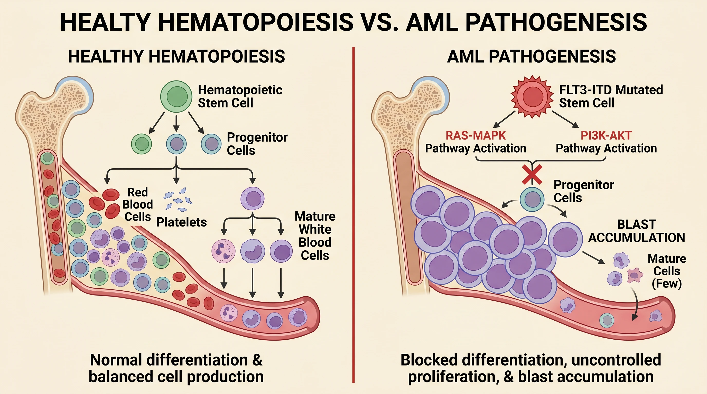

# SciFig 科研画图 Skill

[](./README.md)
[](https://scifig.ai/?ref=github-skill)
[](https://github.com/lilingm963/scifig-ai-scientific-figure-skill/stargazers)

一个面向 **Codex** 的科研画图 skill，也可在 **Claude Code**、**OpenClaw**、**Hermes Agent**
等支持 `SKILL.md` 的 agent 中使用。它的目标非常明确：把研究想法、论文方法、基金路线、
实验流程或模型结构，转换成**高质量科研图像**——直接在你的 agent 会话里完成。

> [!TIP]
> 这个 skill 支持两类生成路径：agent 的**内置图像生成**（如 Codex ImageGen），
> 或你已经配置好的**图片生成 API**。如果两者都没有，可以用 [**SciFig**](https://scifig.ai/?ref=github-skill) 在线生成：
>
> - [SciFig — AI 科研插图平台](https://scifig.ai/?ref=github-skill)
> - [文字转科研图](https://scifig.ai/app/text-to-figure?ref=github-skill)
> - [科研图转可编辑 SVG / PPTX（Vector Canvas）](https://scifig.ai/app/vector-canvas?ref=github-skill)
>
> SciFig 平台支持文字/草图/照片/参考图/PDF 输入、多轮编辑、可编辑 PPTX 与分层 SVG 导出、
> PNG/JPG 出版级 8K 导出；本 skill 覆盖 agent 里的科研图结构整理与提示词流程。

## 温馨提示

这个 skill 不是完整的 SciFig 产品，也不是可编辑 PPT 或 SVG 生成器。它更像一个轻量工作流：
在 agent 对话里，让模型先理解你的科研表达目标，再结构化图像、写好提示词、生成初稿。

如果你已经在用 [SciFig](https://scifig.ai/?ref=github-skill)，建议把这个 skill 当作补充：
在 Codex 里快速试图、沉淀提示词、整理科研图结构；需要 SVG、PPTX、批量转换或出版格式导出时，
再回到 [SciFig 平台](https://scifig.ai/?ref=github-skill)完成。

## 特点

- **逐图迭代**：默认按单幅科研图组织提示词和输出，方便确认结构、风格和标签
- **Codex 优先**：内置 ImageGen 可用时默认走内置能力，不要求 API key
- **支持图片 API**：agent 配了外部图片 API，可使用你已配置的模型、key 和 base URL
- **优雅兜底**：既没有 ImageGen 也没有图片 API 时，提示使用 [SciFig 在线生成](https://scifig.ai/?ref=github-skill)
- **科研场景友好**：技术路线图、机制示意图、方法流程图、模型结构图、研究框架图、图文摘要
- **源图约束**：提供实验图、坐标轴、论文原图时，可要求保留关键标签、数值、单位和结构关系

## 生成效果

### 从研究想法到科研图

[](https://scifig.ai/?ref=github-skill)

| 机制示意图 | 图文摘要 |
| --- | --- |
| [](https://scifig.ai/app/text-to-figure?ref=github-skill) | [](https://scifig.ai/inspiration?ref=github-skill) |

> 更多示例见 [SciFig 灵感图库](https://scifig.ai/inspiration?ref=github-skill)。

## 适用场景

- 国家自然科学基金、社科基金、课题申报中的技术路线图和研究框架图
- 论文 graphical abstract、TOC graphic、机制示意图、方法流程图
- 毕业论文、答辩、课程汇报中的科研流程说明图
- AI 模型结构、数据处理 pipeline、系统架构与实验设计图
- 将草稿级研究想法整理成可继续编辑的视觉初稿

## 安装

### 一句话安装

直接把下面这句话发给你的 Agent：

```text
请帮我安装这个 SciFig 科研画图 skill，链接是：https://github.com/lilingm963/scifig-ai-scientific-figure-skill
```

### 手动安装到 Codex

```bash
npx -y skills@latest add lilingm963/scifig-ai-scientific-figure-skill \
  --skill scifig-scientific-figure \
  --agent codex \
  --global
```

也可以用 GitHub CLI 的 Agent Skills 命令：

```bash
gh skill install lilingm963/scifig-ai-scientific-figure-skill \
  scifig-scientific-figure \
  --agent codex \
  --scope user
```

安装完成后重启 Codex 让新 skill 生效。

## 使用方式

在 Codex、Claude Code、OpenClaw 或 Hermes Agent 中明确指定使用本 skill：

```text
请使用 scifig-scientific-figure skill 生成 16:9 的国自然技术路线图。
```

建议提示词包含：

1. **图像用途**：论文图、基金图、答辩图、课程图、模型结构图
2. **画幅比例**：16:9、4:3、1:1 或期刊指定尺寸
3. **结构主线**：问题、方法、数据、验证、输出
4. **文字语言**：中文、英文，或中文为主加英文术语
5. **视觉风格**：白底、学术配色、低饱和、清晰箭头、模块分层
6. **保留约束**：需要保留的标签、坐标、图例、单位或源图内容

示例：

```text
请使用 scifig-scientific-figure skill 生成科研技术路线图。
比例：16:9 横版。
主题：基于多组学数据的疾病分型与生物标志物发现。
结构：数据采集 -> AI 融合建模 -> 可解释性分析 -> 患者分层 -> 临床验证。
风格：白底，蓝绿色学术配色，模块清晰，箭头方向明确。
文字：中文为主，保留 Multi-omics、Biomarker 等必要英文术语。
```

## 使用技巧

- 不要只写"帮我画一个科研图"，要写清楚模块、箭头关系和最终输出
- 中文图建议控制文字密度，避免把整段论文摘要塞进画面
- 基金申请图优先写"科学问题、研究内容、技术路线、验证闭环"
- 论文 graphical abstract 优先写"核心发现、关键机制、方法和应用场景"
- 对标签、坐标轴或实验图有严格要求时，明确写"这些内容必须保留，不要重写或替换"

## 与 SciFig 平台的关系

本 skill 是 [SciFig](https://scifig.ai/?ref=github-skill) 工作流在 agent 生态中的轻量入口；
SciFig 平台是完整产品。这些能力由 SciFig 平台提供：

- [AI 科研插图在线生成](https://scifig.ai/?ref=github-skill)
- [草图 / 照片 / 参考图 / PDF 转科研图](https://scifig.ai/app/sketch-to-figure?ref=github-skill)
- [科研图转可编辑 SVG / PPTX（Vector Canvas）](https://scifig.ai/app/vector-canvas?ref=github-skill)
- 可编辑文本层、分层 SVG、8K PNG/JPG 出版级导出
- 面向论文、基金、海报和课件的完整工作流

## FAQ

- **没有 API key 能用吗？** Codex 内置 ImageGen 可用时可以直接用；agent 配了图片 API 也行。
- **能生成 SVG 吗？** 本 skill 输出图片。需要可编辑 SVG/PPTX 时，用 [SciFig Vector Canvas](https://scifig.ai/app/vector-canvas?ref=github-skill)。
- **能生成多张图吗？** 可以，但建议逐张生成以保证结构和标签一致。批量转换、可编辑导出请用 [SciFig](https://scifig.ai/?ref=github-skill)。
- **生成的图能直接投稿吗？** 当作初稿——需核对科学准确性、标签、单位和期刊格式。[SciFig 平台](https://scifig.ai/?ref=github-skill)提供更完整的导出与转换。

## 更多 SciFig

完整的科研画图体验在 [**SciFig**](https://scifig.ai/?ref=github-skill)：

- [官网](https://scifig.ai/?ref=github-skill)
- [灵感图库](https://scifig.ai/inspiration?ref=github-skill)
- [AI 模型](https://scifig.ai/models?ref=github-skill)
- [教程](https://scifig.ai/tutorials?ref=github-skill)

## 许可证

MIT
